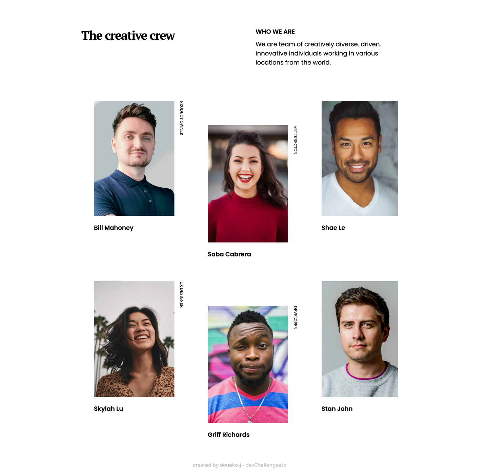

<h1 align="center">My Team Page dev-challenges</h1>

   Solution for a challenge from  <a href="http://devchallenges.io" target="_blank">Devchallenges.io</a>.

  <h3>
    <a href="https://douako-j.github.io/my-team-page-dev-challenges">
      Demo
    </a>
     | 
    <a href="https://github.com/douako-j/my-team-page-dev-challenges">
      Solution
    </a>
     | 
    <a href="https://devchallenges.io/challenges/hhmesazsqgKXrTkYkt0U">
      Challenge
    </a>
  </h3>

<!-- TABLE OF CONTENTS -->

## Table of Contents

- [Overview](#overview)
  - [Built With](#built-with)
- [Features](#features)
- [Contact](#contact)
- [Acknowledgements](#acknowledgements)

<!-- OVERVIEW -->

## Overview

- This project helped me work on my ability to read a Figma design file and transform it into code
- I was able to improve my skill in css layout with flex and grid
- I was also able to work on responsive design management with sass media mixins

### Built With

<!-- This section should list any major frameworks that you built your project using. Here are a few examples.-->

- [HTML](https://www.w3schools.com/html/)
- [CSS](https://www.w3schools.com/css/default.asp)
- [SASS](https://sass-lang.com/)

## Features

<!-- List the features of your application or follow the template. Don't share the figma file here :) -->

This application/site was created as a submission to a [DevChallenges](https://devchallenges.io/challenges) challenge. The [challenge](https://devchallenges.io/challenges/hhmesazsqgKXrTkYkt0U) was to build an application to complete the given user stories.

## Acknowledgements

<!-- This section should list any articles or add-ons/plugins that helps you to complete the project. This is optional but it will help you in the future. For exmpale -->

- [HTML and CSS formation of Dyma](https://dyma.fr/)
- [Steps to replicate a design with only HTML and CSS](https://devchallenges-blogs.web.app/how-to-replicate-design/)

## Contact

- Website [nkoyin.fr](http://www.nkoyin.fr/)
- GitHub [@douako-j](https://github.com/douako-j)
- Instagram [@nkoyinn](https://www.instagram.com/nkoyinn/)
